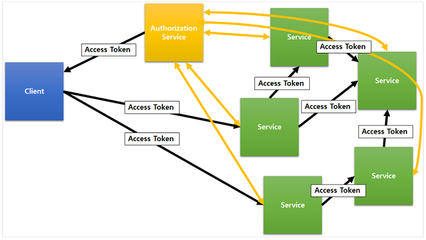
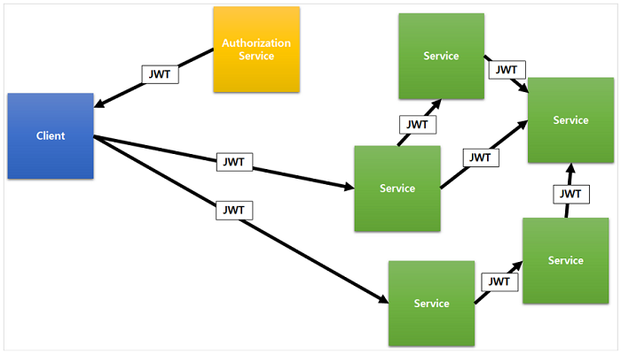
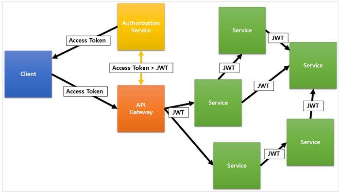

# JWT(JSON Web Token)

JWT = URL-Safe

JWT는 인터페이스 역할을 하는 추상적인 개념.

실제 구현은 `JWS`와 `JWE`

우리가 일반적으로 사용하는 JWT는 대부분 JWS이다.

 - 형식 `HEADER.PAYLOAD.SIGNATURE`

## JWT, JWS, JWE, JWK, JWA

 - `JWT`: 문자가 제한된 환경에서 정보를 주고받을 수 있게 하는 데이터 표현 형식(Format) `RFC 7519`
 - JWT의 서명 관련 명세 --> `JWS` `RFC 7515`
 - JWT의 암호화 관련 명세 --> `JWE` `RFC 7516`
 - `JWK`: JSON형식으로 암호화 키를 표현 `RFC 7517`
 - `JWA`: JWS, JWE, JWK에 사용하는 알고리즘에 대한 명세 `RFC 7518`

<br><br><br><br><hr>

# JWT 활용

## only access token
 - 서비스가 커질수록 인증/인가 서버의 큰 부하와 부담.
 - MSA 방향으로 개발할 때 이슈가 됨


## only jwt token
 - 데이터 노출 및 토큰 갈취를 통한 보안 위협


## access token + jwt 



<br><br><br><br><hr>

https://meetup.toast.com/posts/239

# Nodejs example

```js
const jwt = require('jsonwebtoken');

const symmetricKey = "mysecret"

const token = jwt.sign({
    data: "hello world",
}, symmetricKey)

console.log(token);

console.log("=====")

const headerBase64 = token.split('.')[0]
const payloadBase64 = token.split('.')[1]
const signatureBase64 = token.split('.')[2]

console.log(headerBase64)
console.log(payloadBase64)
console.log(signatureBase64)

console.log("=====")

const headerBuffer = Buffer.from(headerBase64, "base64");

console.log(headerBuffer.toString('utf8'))
console.log(Buffer.from(payloadBase64, 'base64').toString('utf8'))
console.log(Buffer.from(signatureBase64, 'base64').toString('utf8'))
```