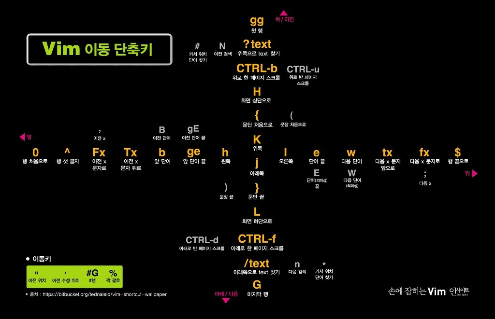

# VIM 설정


## # 파일명
`~/.vimrc`

<hr><br><br><br><br><br>

### - Movement




| command | description |
|:---:|:---:|
| h, j, k, l | 왼쪽(h), 아래쪽(j), 위쪽(k), 오른쪽(l)으로 이동 |
| 0, $ | 단어 단위 앞으로 이동 |
| w, e, b | 단어 단위 앞으로 처음(w), 앞으로 뒤(e), 뒤로(b) 이동 |
| gg, G, `{line number}` + G | 커서를 파일 시작점(gg), 끝점(G), 특정 라인(`{line number}` + G)으로 이동 |
| % | `( )`, `{ }`, `[ ]` 등으로 블록화된 시작점 및 끝점 포인팅 |
| {, } | 문단시작점으로( { ), 문단끝점으로( } ) 이동 |
| `[CTRL]` + u, `[CTRL]` + d | 페이지 단위(1/2)로 위(`[CTRL]` + u), 아래(`[CTRL]` + d)로 이동 |
| `[CTRL]` + b, `[CTRL]` + f | 페이지 단위로 위(`[CTRL]` + b), 아래(`[CTRL]` + f)로 이동 |
| H, M, L | 보여지는 페이지 위(H), 가운데(M), 아래(L)로 커서로 이동 |
| zt, zz, zb | 커서 위치를 위(zt), 가운데(zz), 아래(zb)로 바꾸기 |
| `[]`, `][` | 컬리 블레이스 이동 |

<br><br><br>

### - Editing 

| command | description |
|:---:|:---:|
| `{number}` i `{type something}` `[ESC]` | 편집 커맨드 `i`를 기준으로 입력된 내용 {number}만큼 반복 |
| o, O | 아랫줄 라인(o) 혹은 윗줄 라인(O) 편집|
| r + `{alphabet}`, R | 커서 위치 문자 대체(r), 수정모드(R) |
| c$ (same with `C`), c0, cc | 현재 커서부터 라인의 끝까지(c$), 처음까지(c0), 전체(cc) 재편집 |
| ~ | 대소문자 변경 | 
| `virtual mode` | `v`, `CTRL+v`, `SHIFT+v` |
| `virtual mode` + I | 여러 라인 동시 입력 |
| i, a, I, A | 커서 블록 앞(i), 뒤(a)부터 편집 혹은 라인 맨앞(I), 맨뒤(A) 편집 |
| s, S | 단어 삭제(s) 혹은 줄 삭제(S) 후 편집 모드 |
| <<, >> | 내어쓰기(<<), 들여쓰기(>>) |
| x, X | 글자 삭제(x), 백스페이스(X) |
| dd, D | 행 삭제(dd), d$와 같은 삭제(D) | 
| zc, zo | 코드 접기 (fold), 접힌 코드 펼치기  |
| zM, zR  | 코드 모두 접기 (fold), 접힌 코드 모두 펼치기 |
| zd, zD | fold 지우기, 모든 fold 지우기  |
| J | 다음 라인을 현재 줄의 끝으로 이어 붙임 | 

<br><br><br>

### - Searching

| command | description |
|:---:|:---:|
| f `or` F + `{alphabet}` | 입력한 알파벳 찾기. f(앞), F(뒤)|
| *, # | *(앞으로 같은 단어), #(뒤로 같은 단어) |
| / + `{find target}` + n `or` N | 특정 문자 단어 찾기 후 앞(n) 혹은 뒤(N)로 이동 |
| :, ? | `ex모드`의 `:`와 `?`의 차이는 검색 방향임 |
| s/old/new/`{option}` | `g`(all), `i`(ignore case), `c`(ask)|
| CTRL + o | 이전 커서 위치로 돌아가기 | 


<br><br><br>

### - Command

| command | description |
|:---:|:---:|
| . | 명령어 반복 |
| v | virtual mode |
| :! | shell command |
| :q, :w | quit(:q), save(:w) |
| :edit `or` :e + `{filename}` | 파일 열기 |
| u, `[CTRL]`+R | undo(u), redo(`[CTRL]`+R) |
| :`{size}`vs + `{filename}`, :`{size}`sp + `{filename}` | vertical split(:vs), horizontal split(:sp) |
| = | 자동정렬 |
| " + `(a-z)` + `{command}` | regist 등록 |
| m, ', :marks | 마크설정(m), 마크이동('), 마크리스트(:marks) |
| q + `(a-z)` + `명령어 조합` + q, 사용: `@(a-z)`| 매크로 등록 |
| `[CTRL]`+z, fg % {number} | suspend vim and return terminal. go back vim |
| :colorsheme | 기본 theme 경로는 `/usr/share/vim/vim00/colors`, 그외 theme [다운로드](https://www.vim.org/scripts/script_search_results.php?keywords=&script_type=color+scheme&order_by=creation_date&direction=descending&search=search) |
| :set wrap `or` nowrap | 줄넘김 유무|
| gf, gx | 해당 위치 text의 파일 열기(gf)와 URL열기(gx) |
| `--Netrw--` | :e, Vexplore, Sexplorer |
| `[CTRL]`+p | 이전 커맨드 다시 |


<br><br><br>


### - Netrw

```
:he netrw-v

i : 디렉터리 리스팅 방법 변경.
I : 배너 On / Off 토글
d : 새 디렉터리 생성, 이름 입력 가능
D : 디렉터리 또는 파일 삭제, 삭제 전 확인
R : 디렉터리 또는 파일 이름 수정
s : 정렬 순서 변경(이름, 시간, 파일 사이즈, 확장자 / 상단에 표기)
gh : dot 파일 리스팅에서 추가 /제외 토글
o : 커서 위치의 디렉터리 또는 파일을 상하 스플릿 된 새 창으로 띄우기
v : 커서 위치의 디렉터리 또는 파일을 좌우 스플릿 된 새 창으로 띄우기
t : 커서 위치의 디렉터리 또는 파일을 새 탭으로 띄우기
u : 최근에 방문한 디렉터리로 이동 (뒤로 가기)
U : u 와 반대로 이동
% : 현재 디렉터리에 새 파일 열기, 파일 이름 입력
mb : 현재 디렉터리를 북마크
mB : 북마크에서 1번부터 삭제 (4번 북마크를 삭제하고 싶다면 4mB)
qb : 북마크된 디렉터리 리스팅
gb : 북마크 디렉터리로 이동 (4번으로 이동하고 싶다면 4gb)
```

<br><br><br>

### - window/tab navigating

#### window

```
Ctrl + w (x2) : 시계방향으로 창 이동
Ctrl + w (h,j,k,l) : 해당 방향으로 창 이동

Ctrl + w s : 수평 창 생성 
Ctrl + w v : 수직 창 생성
Ctrl + w c : 현재 창 닫기
Ctrl + w o : 현재 창 제외한 나머지 창 닫기

Ctrl + w, = : 동일 비율 크기 조절
Ctrl + w, _ : 현재 창 높이 최대화
Ctrl + w, | : 현재 창 너비 최대화

Ctrl + w, {n} + : 현재 창 높이 n칸 증가
Ctrl + w, {n} - : 현재 창 높이 n칸 감소

Ctrl + w, {n} > : 현재 창 너비 n칸 증가
Ctrl + w, {n} < : 현재 창 너비 n칸 감소

 - By default, when you create a vertically split window, it will open to the left. To change this default behavior, add the following line to your 'vimrc'.
        $ set splitright

 - Similarly, if you create a new horizontally split window, it will open on the topmost portion of the Vim workspace. To make a new horizontally split window open on the bottom of current window, add the following line to your 'vimrc'.
        $ set splitbelow
```

#### tab

```
:tabnew {filename} : 새탭열기
:tabf {filename} : 존재할 때만 열기
:tabclose : 탭 닫기
:tabs : 탭 목록 보기
gt : 탭 앞으로 이동
gT : 탭 뒤로 이동
```

<br><br><br>

### - Combination skills

| command | description |
|:---:|:---:|
| gg + V + G | 전체 내용 Visual Block |
| gg + = + G | 전체 정렬 |
| :r !명령어 | 명령어 결과를 Write 해줌|
| ??? | 필요한 단어만 선택해서 정렬하기 |
| ??? | Visual Block된 맨끝줄 커서|


#### 닫은 파일 복구
 - :ls 해서 열렸던 파일 확인
 - :b (숫자) -> 해당 파일 다시 열기

#### {Command} + {범위} + {Object}

| list | description |
|:---:|:---:|
| command | d(cut), y(yank), c(change) |
| 범위 | a, i, t, T, f, F | 
| object | w(word), t(tag), p(paragraph), s(sentence), ", / + `{word}`, ... |
| command | d(cut), y(yank), c(change) |


#### 레지스터

| list | description |
|:---:|:---:|
|".| 가장 마지막에 삽입된 문자열을 가지고 있음. 삽입모드에서 CTRL+A나 CTRL+@를 누르면 이 레지스터 사용|
|"%| 현재 편집중인 파일이름 저장|
|":| 가장 최근에 실행된 명령줄을 기억하는 레지스터 |
|"/| 가장 최근에 검색한 데이터 |


#### INSERT MODE

| list | description |
|:---:|:---:|
|CTRL + h| 앞 글자 삭제 |
|CTRL + w| 앞 단어 삭제 |
|CTRL + u| 앞 모두 삭제 |
|CTRL + m| 개행 |
|CTRL + t| 오른쪽으로 들여쓰기 |
|CTRL + d| 왼쪽으로 들여쓰기 | 
|CTRL + e| 커서 아랫줄 문자 입력 |
|CTRL + y| 커서 윗줄 문자 입력 |
|CTRL + r| 레지스터에 저장된 문자 붙여넣기 |

<hr><br><br><br><br><br>

https://dev-in-seoul.tistory.com/m/16

https://vim.rtorr.com/

https://wayhome25.github.io/etc/2017/03/27/vi/

https://github.com/johngrib/simple_vim_guide/blob/master/md/insert_keys.md